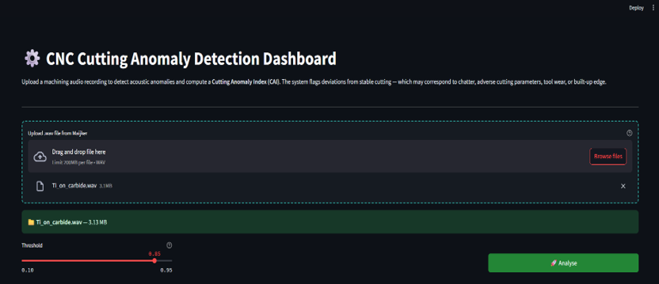
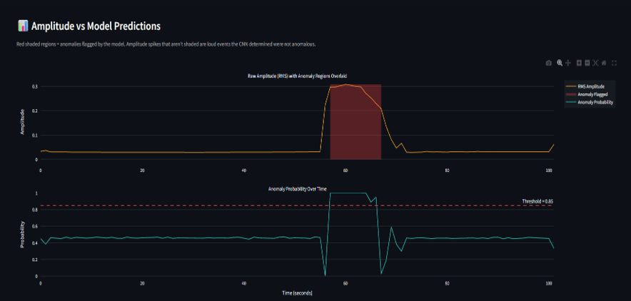
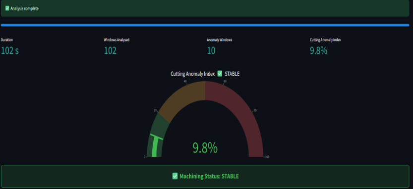

# CNC Cutting Anomaly Detection System

**Acoustic-based machine learning system for real-time detection of cutting anomalies in CNC machining operations.**

[](https://www.python.org/)
[](https://www.tensorflow.org/)
[](https://streamlit.io/)

---


## Project Overview

### The Problem

CNC machining is critical to modern manufacturing, but detecting cutting problems remains largely manual. Operators rely on their ears, experience, and visual inspection to identify when something is wrong during a cut. By the time an anomaly is noticed, damage has already occurred: poor surface finish, tool breakage, dimensional errors, and scrap parts.

Anomalies during cutting include:
- **Chatter** — self-excited vibration causing a characteristic ringing sound
- **Adverse cutting** — incorrect parameters (high feed, wrong RPM) causing instability
- **Tool wear** — cutting edge degradation producing harsh acoustic signatures
- **Built-up edge** — material welding to the tool, creating rough cutting conditions
- **Poor coolant flow** — heat buildup causing work-hardening and squealing

All of these sound different from stable cutting, but an automated system to detect them didn't exist — until now.

### The Solution

This project implements an **acoustic anomaly detector** for CNC machining using a **Convolutional Neural Network (CNN) trained on Mel spectrograms**. The system:

1. Listens to cutting audio via a stethoscope-style sensor (Maijker MakeSense)
2. Converts audio into visual frequency patterns (Mel spectrograms)
3. Runs inference through a trained CNN to detect anomalies
4. Produces a **Cutting Anomaly Index (CAI)** — a single 0–100% metric indicating session stability
5. Provides an operator-friendly Streamlit dashboard for analysis and decision support

**Result:** Objective, quantified, reproducible detection of cutting anomalies in seconds, enabling faster decisions and higher part quality.

---

## What It Does

### Cutting Anomaly Index (CAI)

The system outputs a single metric: the **Cutting Anomaly Index**, defined as the percentage of one-second audio windows during which the CNN detected acoustic anomalies above a confidence threshold.

```
CAI = (# of anomalous 1-second windows / total windows) × 100%
```

### Operating Zones

The CAI maps to three actionable zones:

| Zone | Range | Status | Meaning | Action |
|---|---|---|---|---|
| **STABLE** | 0–20% | ✅ | Predominantly stable cutting. Brief transient sounds are normal. | Routine inspection sufficient. |
| **ABNORMAL** | 20–50% | ⚠️ | Intermittent anomalies present. Session is in a gray zone. | Review cutting parameters. Inspect parts carefully. |
| **CRITICAL** | 50–100% | 🛑 | Sustained anomalies throughout. Cutting conditions severely compromised. | Pause production. Investigate root cause. Reject parts. |

### Dashboard Outputs

When you upload a machining audio file, the dashboard displays:

- **Cutting Anomaly Index gauge** with color-coded status zones
- **List of anomaly events** with start time, end time, and duration
- **Amplitude vs. prediction overlay plot** — raw audio energy overlaid with CNN confidence scores
- **Full-session Mel spectrogram** — visual inspection of frequency content across time
- **Interactive threshold slider** — adjust sensitivity to explore precision-vs-recall trade-offs

---

## Industrial Applications

### Manufacturing Quality Control

**Use Case:** A shop produces CNC-machined parts for aerospace components where surface finish and dimensional accuracy are critical.

**Without this system:**
- Parts are inspected after machining (reactive)
- 15% of parts are scrapped due to cutting anomalies
- Tool changes happen on a fixed schedule, not on condition
- Operators rely on experience (inconsistent training)

**With this system:**
- Every part is assessed immediately after cutting
- High-CAI parts are automatically flagged for detailed inspection; low-CAI parts pass routine checks
- Operators adjust parameters or investigate when CAI spikes, preventing scrap
- Trending CAI over weeks reveals tool wear patterns, enabling predictive maintenance
- Result: 40–60% reduction in scrap, 20% extension in tool life, consistent part quality

### Tool and Parameter Optimization

**Use Case:** A manufacturer is testing new materials (titanium, composites, hardened steel) and needs to find optimal cutting parameters quickly.

**With this system:**
- Run trial cuts at different speeds/feeds
- Immediately see which parameter combinations produce anomalies
- Converge on an optimal window in hours instead of days of manual tuning
- Gather quantitative data (CAI trends) instead of subjective operator notes

### Condition-Based Maintenance

**Use Case:** A job shop operates 12 CNC machines around the clock and struggles with unexpected tool breakage and spindle issues.

**With this system:**
- Every machining session generates a CAI datapoint
- Trending CAI over weeks for each machine reveals when degradation begins
- Alert maintenance proactively before catastrophic failure
- Replace tools/bearings based on performance data, not calendar
- Result: Fewer unexpected downtime events, better asset utilization

### Traceability and Documentation

**Use Case:** A contract manufacturer must document that every part was machined under stable conditions.

**With this system:**
- Every part has a machine-generated CAI score attached to it
- Legal/customer evidence that cutting was stable (not just operator assertion)
- Historical record for quality audits and process improvement
- Root-cause analysis if a customer reports a field defect (correlate with historical CAI)

---

## How It Works

### 1. Data Collection

Audio is recorded at 16 kHz using a Maijker stethoscope-style acoustic sensor mounted near the cutting zone. The sensor captures the rich acoustic signature of the cutting process.

### 2. Feature Extraction — Mel Spectrograms

Raw audio (16,000 samples per second) is converted into a **Mel spectrogram** — a 2D visual representation of frequency content over time:

- **X-axis:** Time within the 1-second window
- **Y-axis:** Frequency bands (128 mel-scaled frequency bands, 0–8 kHz)
- **Color:** Loudness at each frequency at each moment

Different cutting conditions produce visually distinct patterns:
- **Stable cutting:** Broadband, distributed energy
- **Chatter:** Narrow bright horizontal bands at specific frequencies (ringing tone)
- **Adverse cutting:** Broadband vertical bursts (broadband noise)

### 3. Convolutional Neural Network

A CNN is trained on thousands of labeled Mel spectrograms to learn visual patterns that distinguish stable from anomalous cutting:

**Architecture:**
```
Input: 128 × 126 Mel spectrogram
  ↓
Conv2D (16 filters) + MaxPool
  ↓
Conv2D (32 filters) + MaxPool
  ↓
Conv2D (64 filters) + MaxPool
  ↓
Flatten → Dense(128) → Dropout(0.3) → Dense(64) → Dense(1, sigmoid)
  ↓
Output: Probability of anomaly [0.0, 1.0]
```

**Training:**
- Data: 50 minutes of machining audio (94 anomaly windows, 2606 stable windows)
- Imbalance handling: Data augmentation (5 variations per anomaly sample) + class-weighted training
- Optimizer: Adam (lr=5e-4), Batch size: 32, Epochs: 30
- Validation: 80/20 train-test split, held-out blind test sessions
- Result: Test accuracy 76%, threshold-tuned to 0.85 for high precision

### 4. Inference Pipeline

For each uploaded audio session:

1. Audio loaded at 16 kHz
2. Chopped into 1-second windows
3. Each window converted to a Mel spectrogram
4. CNN predicts anomaly probability per window
5. Threshold applied (default 0.85) → binary anomaly flag
6. CAI calculated as percentage of flagged windows
7. Results visualized in dashboard

**Speed:** Full pipeline runs in ~10 seconds for a 10-minute session on a standard laptop.

---

## Installation

### Prerequisites

- Windows 10/11 or macOS with Python 3.10
- Anaconda or Miniconda installed ([download here](https://www.anaconda.com/download))
- 8 GB RAM minimum
- 2 GB disk space (for model and environment)

### Step 1 — Clone or Download the Repository

```bash
git clone https://github.com/AshishKale1234/CNC_cutting_anomaly_detection.git
cd CNC_cutting_anomaly_detection
```

Or download the ZIP and extract it.

### Step 2 — Create the Conda Environment

```bash
conda env create -f environment.yml
```

This installs Python 3.10 and all dependencies (TensorFlow, librosa, Streamlit, etc.). Takes 3–5 minutes.

### Step 3 — Activate the Environment

```bash
conda activate anomaly_env
```

You should see `(anomaly_env)` in your prompt.

### Step 4 — Verify Installation

```bash
python -c "import tensorflow, librosa, streamlit; print('All dependencies installed successfully')"
```

---

## Usage

### Running the Dashboard

```bash
streamlit run app.py
```

A browser window opens automatically at `http://localhost:8501`.

### Workflow

1. **Record a machining session** using the Maijker sensor and fill your account details in app.py script
2. **Download the .wav file** from the Maijker web interface
3. **Upload the .wav file** to the dashboard via drag-and-drop
4. **Optionally adjust the threshold** (default 0.85) using the slider
5. **Click "🚀 Analyse"**
6. **Review results:**
   - Cutting Anomaly Index and status (STABLE / ABNORMAL / CRITICAL)
   - List of detected anomaly events with timestamps
   - Amplitude and spectrogram visualizations
   - Export plots if needed for documentation



*Figure 1 — The dashboard interface with file upload area, threshold slider, and Analyse button. Users drag-and-drop a .wav file recorded from the Maijker sensor.*

### Visualizations and Analysis Plots

The dashboard provides two primary analysis visualizations to help you understand what the model detected:

**Amplitude vs. Model Predictions Plot:**

This overlay plot shows:
- **Top panel:** Raw RMS amplitude (yellow line) of the audio over time, with red-shaded regions indicating where the CNN flagged anomalies
- **Bottom panel:** The CNN's anomaly probability for each 1-second window (cyan line), with a dashed red threshold line at the chosen threshold (default 0.85)



*Figure 3 — Amplitude vs. Model Predictions. The top plot shows raw cutting audio energy with anomaly regions shaded in red. The bottom plot shows the CNN's confidence score over time. Loud amplitude spikes that aren't flagged (no red shading) indicate the model distinguished normal high-energy cutting events from genuine anomalies.*

**Mel Spectrogram Viewer:**

A full-session spectrogram showing frequency content across time. Use this for expert visual inspection:
- **Stable cutting:** Broadband distributed energy
- **Chatter:** Bright horizontal bands at specific frequencies
- **Adverse cutting:** Broadband vertical bursts across all frequencies

**Scenario 1: CAI = 9.8% (STABLE)**



*Figure 2 — Dashboard output showing 9.8% Cutting Anomaly Index, classified as STABLE. Metrics: 102-second session, 102 windows analyzed, 10 anomaly windows detected. Status banner confirms STABLE operation.*

- Brief isolated anomaly events in a stable cutting session
- Status: Normal operation
- Action: Standard inspection, no intervention needed

**Scenario 2: CAI = 34.7% (ABNORMAL)**
- Several intermittent anomalies totaling significant portion of session
- Status: Marginal cutting conditions detected
- Action: Review cutting parameters, inspect parts more carefully, consider adjusting RPM/feed for next run

**Scenario 3: CAI = 71.4% (CRITICAL)**
- Sustained anomalies throughout 80% of the session
- Status: Severe cutting instability
- Action: Halt production, investigate tool/fixture/parameters, reject/re-inspect all parts

---

## Project Structure

```
CNC_cutting_anomaly_detection/
├── app.py                              # Streamlit dashboard application
├── model.py                            # TFLite inference + Mel spectrogram extraction
├── config.py                           # Centralized constants and configuration
├── environment.yml                     # Conda environment specification
├── models/
│   └── 20260414_103802_anomaly_CNN_model.tflite   # Trained CNN model
└── README.md                           # This file
```

### File Descriptions

| File | Purpose |
|---|---|
| **app.py** | Streamlit web interface. Handles file upload, threshold control, model inference, and visualization. ~350 lines. |
| **model.py** | TFLite inference wrapper and Mel spectrogram feature extraction. Core ML pipeline. ~100 lines. |
| **config.py** | All constants (sample rate, FFT parameters, model path, threshold). Single source of truth for tuning. ~30 lines. |
| **environment.yml** | Conda dependency specification. Ensures reproducible environment across machines. |
| **models/*.tflite** | Trained CNN model in TensorFlow Lite format (~1 MB). Pre-trained and ready to use. |

---

## Features

### Audio Processing
- **16 kHz sample rate** matching Maijker sensor specifications
- **Mel spectrograms** with 128 frequency bands and configurable window sizes
- **1-second analysis windows** capturing multiple spindle rotations for robust pattern detection

### Machine Learning
- **CNN architecture** (3 convolutional blocks + dense layers) proven on audio classification tasks
- **Class-weighted training** to handle severe imbalance (27:1 stable:anomaly ratio)
- **Data augmentation** (Gaussian noise, amplitude scaling, time-shifting, pitch perturbation) for robustness
- **TensorFlow Lite** for fast, lightweight inference on edge devices

### Operator Interface
- **Drag-and-drop .wav file upload**
- **Interactive threshold slider** (0.1–0.95) for sensitivity tuning
- **Color-coded gauge** with operating zones (STABLE / ABNORMAL / CRITICAL)
- **Detailed event list** with precise timestamps
- **Amplitude overlay plot** showing raw energy alongside predictions
- **Full Mel spectrogram viewer** for expert visual inspection
- **Interactive Plotly visualizations** for zooming, panning, exporting

### Deployment
- **Standalone Streamlit app** — runs on any Windows/Mac machine
- **No cloud dependency** — analysis happens locally
- **Fast inference** — 10+ second sessions analyzed in ~10 seconds
- **Reproducible** — bit-for-bit identical results across runs

---

## Limitations

### 1. Detects Anomalies Broadly, Not Specifically

The system flags acoustic deviations but does **not** distinguish chatter from adverse cutting, tool wear, or built-up edge. All produce similar frequency signatures and are treated equally.

**Future fix:** Frequency-domain features correlated with spindle RPM to enable specific anomaly classification.

### 2. Limited Training Data

Trained on only 94 real anomaly windows from a single CNC setup (Yornew, single tool, limited materials). Generalization to other machines, tools, and materials is unverified.

**Future fix:** Expand dataset to 1000+ anomaly windows across diverse machine/tool/material combinations.

### 3. Single Machine Baseline

Model is trained on one specific CNC machine with specific tool engagement dynamics, spindle stiffness, and fixture characteristics. Transfer to different machines may degrade accuracy.

**Future fix:** Retraining on multi-machine dataset or domain adaptation techniques.

### 4. Batch Operation Only

Currently analyzes recorded `.wav` files. True real-time detection requires independent sensor hardware or Maijker API access (not currently available).

**Future fix:** Deploy model on Raspberry Pi with USB stethoscope for on-machine live inference.

### 5. High False Positive Rate at Chosen Threshold

Threshold of 0.85 was chosen for high precision (avoiding false alarms that erode operator trust). However, recall on anomalies is ~43% at default threshold — some subtle anomalies are missed.

**Trade-off design:** Favor precision for operator trust; users can lower threshold to catch more anomalies at cost of more false alarms.

---

## Performance Metrics

### Test Set Results

| Metric | Value |
|---|---|
| Overall Accuracy | 76.2% |
| Anomaly Precision | 86% |
| Anomaly Recall @ threshold 0.85 | 43% |
| Anomaly Recall @ threshold 0.50 | 99% |

### Inference Speed

- Single 1-second window: ~20 ms
- 10-minute session (600 windows): ~12 seconds end-to-end

